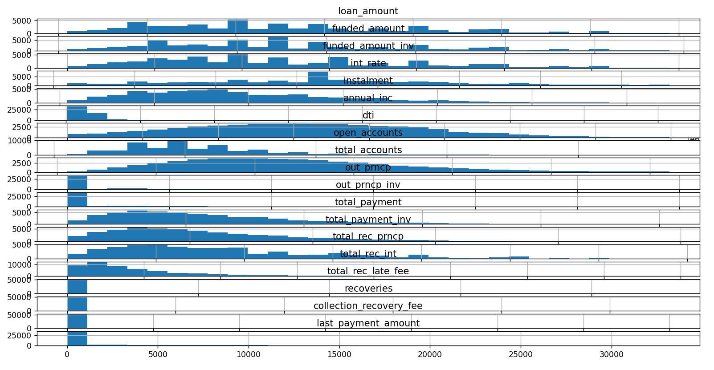

# Exploratory Data Analysis - Customer Loans in Finance

---

## Contents

- Introduction
- Findings
- Usage
- Dataset Schema

---

## Introduction

This project is a practice study on a real world example:
- Imagine I am working for a large financial institution, where managing loans is a critical component of business operations.
- To ensure informed decisions are made about loan approvals and risk is efficiently managed, my task is to gain a comprehensive understanding of the loan portfolio data.
- My task is to perform exploratory data analysis on the loan portfolio, using various statistical and data visualisation techniques to uncover patterns, relationships, and anomalies in the loan data.
- This information will enable the business to make more informed decisions about loan approvals, pricing, and risk management.
- By conducting exploratory data analysis on the loan data, I aim to gain a deeper understanding of the risk and return associated with the business' loans.
- Ultimately, my goal is to improve the performance and profitability of the loan portfolio.

---

## Findings

### Null Values

First we must decide what to do with null values, the first thing is to create a null matrix and see if there is any pattern to null values

As can be seen, there are four columns with significant null values that must be dropped before proceeding.

Once these have dropped remaining columns with null values must be imputed, I did this using median imputing for numerical data and mode imputing for categorical data.

### Correcting Skew

THe next step is to correct skew, some values had high skew which will effect analysis and so must be corrected.

We can plot the distribution for each column and this can help demonstrate the skew

After applying a log transform on heavily skewed columns we have the below

The skewness has now reduced

### Remove Outliers

Now we must remove outliers to help better represent our data, this can be easily visualised from a box-plot which will indicate any possible outliers

We can use this to remove outliers above a certain value, however, as can be seen some columns have a large number of possible outliers, so we must look deeper into this.

I looked at the seperate distribution graphs and manually decided whether these outliers were credible

### Overly Correlated Columns

Now we must remove any columns that are highly correlated, this can be done by analysing a correlation matrix

Any columns with high correlation must be removed via choosing a threshold, the below is the final correlation matrix

### Current State of Loans

Analysis on the current state of loans, this will show how much has be returned

Total Loan Amount: £723066050.0
Total Investor Funded Amount: £702433696.79
Total Payments Made: £655067555.06
Recovered Against Loan Amount 90.6%
Recovered Against Investor Funded 93.26%

We can also predict the state over the next 6 months time

Return Percentage at 6 months from Loan Amount: 98.0%
Return Percentage at 6 months from Invested Amount: 100.88%

### Calculating Loss

Analysis on the current state of charged off Loans

Number of Charged Off Loans: 5571
Percentage that is Charged Off Loans: 10.27%
Total Payment of Charged Off Loans: £37400589.04

### Calculating Projected Loss

Analysis on loss from all chraged off loans

Total Revenue Lost £93561683.7
Pecentage of Revenue Lost: 8.4%

### Possible Loss

Analysis on total possible loss from late loans, defaults and charge off

Total Number of Late Status: 686
Percentage of Members in Late Status: 1.26%
Total Lost if Late Loans Charged Off: £11179405.64
Total Lost for Late, Default and Charged Off: £105609743.16
Percentage Lost of Total Revenue: 9.48%

### Loss Indicators

We can find if there's a correlation between certain columns and loan_status

Below is the correlation matrix

There is a strong negative correlation between grade and interest rate so these must be linked. However these two columns have a high correlation. Grade is likely a good factor in loan status.

Theres also correlation with verification status, dti, delinq_2yrs, inq_last_6mths

---

## Usage

### Class RDSDatabaseConnector

Represents an Amazon RDS Connection

#### ***.initialise_sql***

Converts the class arguments into a usable URL, creates an sql engine from this url

#### ***.create_dataframe***

Converts the gathered SQL file into a pandas dataframe

#### ***.create_csv***

Creates a .csv file from the pandas dataframe

---

### Class DataFrame

Represents the Data Transform from csv to Data Frame

---

### Class DataFrameInfo

Represents the information and processes for the DataFrame

#### ***.info***

Shows information on the dataframe

#### ***.median_col***

Gives a median of a given column

#### ***.std_col***

Gives a standard deviation of a given column

#### ***.mean_col***

Gives a mean of a given column

#### ***.mode_col***

Gives a mode of a given column

#### ***.value_counts***

Gives the counts of each unique value of a given column

#### ***.nunique***

Gives the number of unique values of a given column

---

### Class DataFrameTransform(DataFrameInfo)

Represents transformations on the dataframe

#### ***.drop_cols***

drops columns provided

#### ***.median_impute***

imputes the median value of the column into null values

#### ***.mode_impute***

Imputes the mode value of the column into null values

#### ***.ffill_impute***

Imputes via forward fill of the column into null values

#### ***.correct_skew***

Reduces the skew via log transformation

#### ***.remove_outliers***

Removes outliers from the dataframe

---

### Class Plotter(DataFrameTransform)

Represents plotting information

#### ***.plot_null***

Creates a plot of null values within the dataframe

#### ***.plot_dist_col***

Creates a histogram distribution plot for a given column

#### ***.plot_dist***

Creates a histogram distribution plot for all numeric columns in dataframe

#### ***.plot_qq_col***

Creates a qq plot for a given column

#### ***.plot_qq***

Creates a qq plot for all numeric columns in dataframe

#### ***.plot_box_col***

Creates a box plot for a given column

#### ***.plot_box***

Creates a box plot for all numeric columns in dataframe

#### ***.corr_matrix***

Creates a correlation matrix for all numeric columns in dataframe

---

### .create_sql_class

Creates a class to connect to the RDS with load_credentials (below) output as an argument

### .load_credentials

Converts the YAML file into a dictionary, intended for use to gather credentials to connect with RDS

### .load_csv

Converts the csv file into a pandas dataframe, the csv file will be generated from the RDSDatabaseConnector Class

### .transfor_data

Converts a dataframe and converts column type

### .transform_dataframe

Performs all desired dataframe transformations

### .current_state

Prints an analysis of the current state of loans

### .sixmnths_state

Prints a predicted analysis for 6 months in the future

### .calculate_loss

Shows the current status of charged off loans

### .calculate_projected_loss

Shows the current loss by Charged Off Loans by total that would have been taken from Loan

### .possible_loss

Shows the potential possible loss if late payments default or charged off

### .loss_indicators

Gives a correlation matrix to determine what effect each variable has on loan_status

### .initialise

Creates, formats, transforms and sets up for plotting (MUST BE RAN FIRST)

---

## Dataset Schema

- **id**: unique id of the loan
- **member_id**: id of the member to took out the loan
- **loan_amount**: amount of loan the applicant received
- **funded_amount**: The total amount committed to the loan at the point in time 
- **funded_amount_inv**: The total amount committed by investors for that loan at that point in time 
- **term**: The number of monthly payments for the loan
- **int_rate**: Interest rate on the loan
- **instalment**: The monthly payment owned by the borrower
- **grade**: LC assigned loan grade
- **sub_grade**: LC assigned loan sub grade
- **employment_length**: Employment length in years.
- **home_ownership**: The home ownership status provided by the borrower
- **annual_inc**: The annual income of the borrower
- **verification_status**: Indicates whether the borrowers income was verified by the LC or the income source was verified
- **issue_date:** Issue date of the loan
- **loan_status**: Current status of the loan
- **payment_plan**: Indicates if a payment plan is in place for the loan. Indication borrower is struggling to pay.
- **purpose**: A category provided by the borrower for the loan request.
- **dti**: A ratio calculated using the borrower’s total monthly debt payments on the total debt obligations, excluding mortgage and the requested LC loan, divided by the borrower’s self-reported monthly income.
- **delinq_2yr**: The number of 30+ days past-due payment in the borrower's credit file for the past 2 years.
- **earliest_credit_line**: The month the borrower's earliest reported credit line was opened
- **inq_last_6mths**: The number of inquiries in past 6 months (excluding auto and mortgage inquiries)
- **mths_since_last_record**: The number of months since the last public record.
- **open_accounts**: The number of open credit lines in the borrower's credit file.
- **total_accounts**: The total number of credit lines currently in the borrower's credit file
- **out_prncp**: Remaining outstanding principal for total amount funded
- **out_prncp_inv**: Remaining outstanding principal for portion of total amount funded by investors
- **total_payment**: Payments received to date for total amount funded
- **total_rec_int**: Interest received to date
- **total_rec_late_fee**: Late fees received to date
- **recoveries**: post charge off gross recovery
- **collection_recovery_fee**: post charge off collection fee
- **last_payment_date**: Last month payment was received
- **last_payment_amount**: Last total payment amount received
- **next_payment_date**: Next scheduled payment date
- **last_credit_pull_date**: The most recent month LC pulled credit for this loan
- **collections_12_mths_ex_med**: Number of collections in 12 months excluding medical collections
- **mths_since_last_major_derog**: Months since most recent 90-day or worse rating
- **policy_code**: publicly available policy_code=1 new products not publicly available policy_code=2
- **application_type**: Indicates whether the loan is an individual application or a joint application with two co-borrowers
